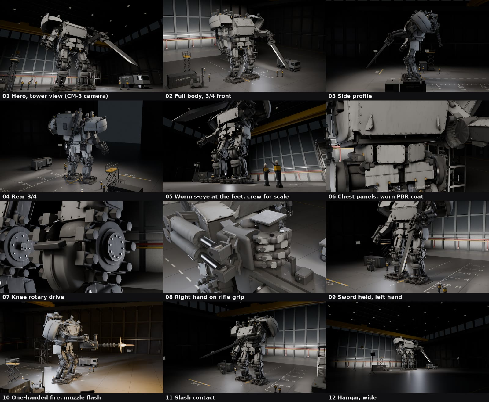

<p align="center">
  <strong>Directing Agent Teams</strong><br>
  <em>Hand a big build to a team of Claude Code subagents, and keep it honest while you sleep.</em><br>
  <em>One Director, time-boxed slices, a verifier for every builder, and handoffs that survive context deaths.</em>
</p>

<p align="center">
  <a href="LICENSE"></a>
  <a href=".github/workflows/checks.yml"></a>
</p>

<p align="center">
  <a href="https://www.linkedin.com/in/aaddrick/">Connect on LinkedIn!</a>
</p>

Parallel agents fail at the seams: two agents editing one file, two renders fighting over one GPU, a decision that reaches one lead and not the other, a builder that marks its own work as done. This skill has Claude design those seams before anyone builds.

You describe the project. Claude asks one round of questions, writes a plan, and launches one **Director** in the background. From then on Claude only relays. The Director designs the team, runs the work in small time-boxed slices, pairs every builder with an independent verifier, and holds the gates.

It came out of two real overnight builds: an AR video on a Gaussian-splat room tour, and a procedural Blender mech with a rig and an advert render.

<a href="https://www.linkedin.com/feed/update/urn:li:activity:7511020532218195968/"></a>

<p align="center"><em>A still sheet the team passed up to me for review before committing to the full render.</em></p>

---

<div align="center">
  <video src="https://github.com/user-attachments/assets/fcc6476f-8a33-4f8b-9f29-4c90addfa4d7" controls></video>
</div>

<p align="center"><em>The finished 21-second render, built by the agent team from a procedural Blender model, rig and animation.</em></p>

---

<div align="center">
  <video src="https://github.com/user-attachments/assets/4cd0241b-5740-48ca-aa70-c66c2149abb3" controls></video>
</div>

<p align="center"><em>The finished Gaussian Splat render, built by the agent team from captured cell phone video of a hotel room.</em></p>

> [!IMPORTANT]
> Claude Code only. A team of 6 to 14 agents running for hours uses a lot of tokens. Pre-approve the tools your build needs, or a permission prompt stalls the team until you wake up. See [Getting started](docs/getting-started.md).
>
> This is a work in progress, and I'm actively iterating on it. Rules, agents and file layouts can change between updates. If you want a version that stays put, fork the repo and install from your fork.

## Install

```bash
claude plugin marketplace add aaddrick/directing-agent-teams
```

```bash
claude plugin install directing-agent-teams@directing-agent-teams
```

The skill loads on its own when you ask for a team. To load it by hand:

```
/directing-agent-teams:directing-agent-teams
```

For overnight runs, raise the spawn depth and stall timeout first: see [Recommended settings](docs/getting-started.md#recommended-settings).

## Starting a run

```
Use a team of agents to build a 20 second product render of this mech in Blender.
Don't do anything yourself. Keep it going overnight. The GPU is the bottleneck.
```

Claude asks for what only you can give (a reference image, the tone, delivery specs, the agent cap), then launches the Director. While it runs, ask for status, change your mind, pick from contact sheets, or go to bed. See [Running a team](docs/running-a-team.md).

## How it works

```
you ── main session ── Director ──┬── builder ⇄ verifier   (one slice: one test, one artefact, 20–60 min)
       (relays only)   (no code)  ├── builder ⇄ verifier
                                  ├── taste reviewer        (looks at the images, recommends)
                                  └── contrarian            (pre-mortem on the plan)
```

- **Nobody certifies their own work.** Verifiers measure the built output, and a builder's claim reaches you as "unverified until QA".
- **Cheap options before anything expensive.** You pick from a contact sheet before a full render or long run.
- **One lock per scarce resource,** so agents share one GPU without fighting over it.
- **Files are the record.** `BOARD.md` maps roles to agent IDs, and every role keeps a handoff file, so a context death costs little.

More in [Architecture](docs/architecture/index.md), including [the incident behind each rule](docs/architecture/incidents.md).

## The agents

| Agent | Role |
|---|---|
| `team-director` | Designs the team, writes slice cards, holds the gates (Opus) |
| `team-builder` | Builds one slice, then stops |
| `team-verifier` | Measures one slice against its card: PASS or FAIL with evidence |
| `team-taste-reviewer` | A skeptical audience for stills and clips |
| `team-animator` | Reworks one motion beat to a motion brief |
| `team-extent-verifier` | Lists parts that shrank, grew or vanished since the last good build |
| `team-set-builder` | Adds set dressing or detail as a layer that switches off |
| `team-surfacer` | Adds materials and wear as a layer, with a licence log |
| `contrarian` | Stress-tests the plan before anyone builds |

Claude Code names them `directing-agent-teams:<name>`. See [Agents](docs/agents.md).

## The team learns

The Director adds what each run teaches to the agents' Lessons and to a case study of the project, in the project's `.claude/` folder. It never edits the plugin. To keep a change for every project:

```
/directing-agent-teams:promote team-verifier
```

See [How the team learns](docs/architecture/learning.md).

## Docs

Start at the [docs index](docs/index.md): getting started, running a team, commands, agents, project files, architecture and troubleshooting.

## License

MIT. See [LICENSE](./LICENSE).
