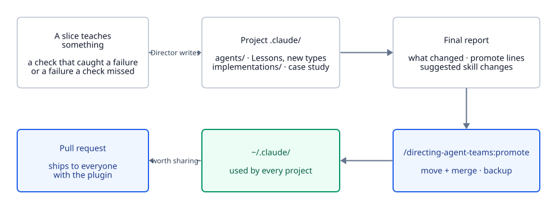

# How the team learns

A run teaches the team things. This page covers where those lessons go, and how they move from one project to every project without anyone editing the plugin.

<picture>
  <source media="(prefers-color-scheme: dark)" srcset="../diagrams/learning-dark.svg">
  
</picture>

## Three kinds of lesson

| Kind | Example | Where it goes |
| --- | --- | --- |
| A lesson for one role | "Distance is not contact: test the grip's wrap per finger" | That agent's Lessons list, as one dated line |
| A lesson for one kind of project | "At 15–20 m, human proportions look spindly" | The project's case study |
| A rule for every project | "After two rejected sheets, ask for a reference" | "Suggested skill changes" at the end of the case study |

A recurring role with a new contract becomes a new agent type rather than a Lesson. See [Agents](../agents.md#how-agents-change-during-a-run).

## Nobody edits the plugin

Every plugin update replaces the plugin's files, and your user-level copies are shared by every project, so the Director writes only into the project:

- **Agent changes** go in `.claude/agents/` (mechanics in [Agents](../agents.md#how-agents-change-during-a-run)).
- **The case study** goes in `.claude/directing-agent-teams/implementations/<project>.md`, started at M0 and updated at each gate and at wind-down.
- **General rules** go in the case study's "Suggested skill changes" section.

## The case study's shape

From [`implementations/README.md`](../../skills/directing-agent-teams/implementations/README.md):

1. **Best execution:** how the project *should* have run from launch to delivery, written with hindsight as a plan to copy: the launch questions, the team, the gates, the checks and the order.
2. **Lessons learned:** what actually happened and what each misstep cost. One section per run, headed `Lessons learned (run of <date>)`, newest last.
3. **Suggested skill changes** (optional, always last).

The shipped mech case, [`blender-mech-advert.md`](../../skills/directing-agent-teams/implementations/blender-mech-advert.md), is the worked example.

## Which copy wins

For agents, a project copy wins over your user copy, which wins over the plugin's: see [Which copy gets spawned](../agents.md#which-copy-gets-spawned). Case studies don't compete; the main session and the Director read all three folders when they look for a similar past project.

## Keeping something for every project

The final report lists every changed agent and the case study, each with a `/directing-agent-teams:promote <name>` line. See [Commands](../commands.md).

## Sending it upstream

Suggested skill changes, and agent Lessons or case studies that would help anyone, only reach other users through a pull request to this repository. See [CONTRIBUTING](../../CONTRIBUTING.md) for where each kind goes.
