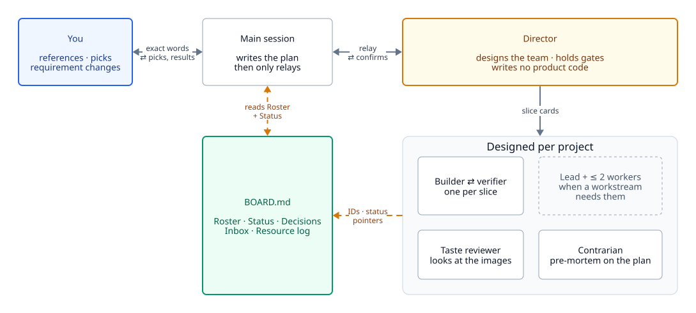

# Overview

The team's shape: two fixed layers on top, and everything below them designed from the work.

<picture>
  <source media="(prefers-color-scheme: dark)" srcset="../diagrams/team-structure-dark.svg">
  
</picture>

Diagram sources live in [`docs/diagrams`](../diagrams) as [D2](https://d2lang.com) and render to the SVG pairs above via `docs/diagrams/render.sh`. Edit the `.d2` files and re-run that script. The SVGs are generated, so don't hand-edit them.

Shape and color carry meaning across every diagram in these pages:

| | Meaning |
| --- | --- |
| Plain box | An ordinary agent or step |
| Amber box | A gate or a decision point: somewhere work is held until it passes |
| Dashed box | Optional: used only when the project needs it |
| Green box | Where results land: a record or an end state |
| Blue box | A place where you are required |
| Dashed amber edge | A loop, a read-back, or a fix round |

## The core idea

Parallel agents fail at the seams: two agents editing one file, two jobs fighting over one GPU, a decision that reaches one lead and not the other, and a builder that certifies its own work. The skill makes the Director design those seams before anyone builds, and write them into the plan.

## The fixed top two layers

**The main session** is the Claude you talk to. Before launch it asks you one round of questions, writes `PLAN_<project>.md` and `BOARD.md`, and spawns the Director. After that it only relays: your exact words go down, results and picks come up. It doesn't build, and it doesn't act on messages that reach it by mistake. It forwards them.

**The Director** is a `team-director` agent, spawned by the main session itself, in the background. It designs the team, writes slice cards, holds the gates, owns BOARD's Roster, Ownership and Decisions, and writes the final report. It writes no product code.

The main session must spawn the Director directly. If another agent spawned it, every role underneath would lose a layer of spawn depth.

## Designed per project

Everything under the Director comes from the work. The Director:

- **Splits by ownership boundary and failure mode,** not by job title: files, shots, stems, scenes or sub-questions, each with one owner.
- **Keeps QA independent.** Its shape (one lead, per-domain reviewers, a taste panel) is the Director's call, but QA never edits product code.
- **Separates ideation from implementation** for a designed thing (an object, a character, an interface). A design owner writes a machine-readable spec and never builds. An implementer builds to the spec, with workers split by region off the same spec.
- **Runs a contrarian** on the plan or storyboard before it's final.

Two team shapes have worked:

- **Flat slices:** the Director pairs a builder with a verifier per slice and runs many slices at once. In the mech run this moved many items at once and needed no leads.
- **Leads with workers:** one lead per workstream, each with up to 2 workers, for work that splits into big independent streams (the AR video run had seven, QA included).

[`examples.md`](../../skills/directing-agent-teams/examples.md) has worked shapes for an AR video, a Blender scene, a music composition and a research report. They are shapes to adapt, not templates.

## Seams the Director designs up front

Before anyone builds, the Director writes these into the plan ([`director.md`](../../skills/directing-agent-teams/director.md) → "Seams"):

| Seam | What gets decided |
| --- | --- |
| Scarce resources | One lock per resource, a fixed order to take them in, and budgets for RAM, disk and CPU. See [resources-and-locks.md](resources-and-locks.md) |
| Iteration cost | What a preview is (length, resolution, samples, minutes) and what full scale is. Full scale only at gates, a fixed number per item |
| M0 interface | The shared API, schema and data, built by one interface-owning lead before anyone fans out |
| M0 proof | The invariant that matters: matches the old pipeline, or fixed inputs untouched and builds deterministic from a seed |
| Ownership map | Every path the work touches, existing shared code included, with one owner each. When an owner finishes, its paths move to a named owner (the Director by default). Nothing is unowned |
| Cross-workstream inputs | Each lead writes `notes/<ws>.md` (methods, key numbers, paths) at each gate. Other roles read notes, not code |
| Missing user inputs | Placeholders, clearly labelled PROVISIONAL, swappable in one step, and listed in the final report |
| Scope | Deliverables come from you. Ideas from the examples or the team go in the report as optional suggestions, not into the build |
| Scope risk | Every item is marked core or cuttable up front. After 3 failed QA rounds, the Director cuts it or accepts it with a known issue |

## Depth

Agents can spawn agents only down to `CLAUDE_CODE_MAX_SUBAGENT_SPAWN_DEPTH` layers below the main session (default 3). The Director is layer 1, and the deepest layer can't spawn. Each extra layer adds routing and handoff cost, so the Director uses depth only where a lead truly needs sub-workers. If the plan relies on the deepest layer, the Director checks at M0 that an agent there still has the `Agent` tool.

## The runtime is flat

"Layers" are a reporting convention. At runtime every agent in the session is in one pool, and any agent can message any other by ID, across branches. A worker keeps running after its spawner stops. That's why a replacement lead can take over its predecessor's live workers. See [communication.md](communication.md).

## The agent cap

The plan sets a cap on active agents: 6 by default, often 8 to 10 for creative builds with parallel part modellers. Every spawned agent counts, including reviewers, the contrarian and workers. The Director counts; the main session doesn't.

- Every builder needs a verifier, so a new workstream costs two slots. The Director plans the cap at about 2× the concurrent builders, plus 1.
- Leads that are idle hand off and stop, and are respawned from their handoff file when needed. Turnover doubles as scheduling.
- Resource locks usually make extra agents sit idle anyway, so a higher cap doesn't always mean faster.

## Runtime limits

From [`runtime-facts.md`](../../skills/directing-agent-teams/runtime-facts.md), checked on Claude Code v2.1.284:

- At most 20 concurrent subagents by default (`CLAUDE_CODE_MAX_CONCURRENT_SUBAGENTS`), and 10 parallel read-only tools plus subagents (`CLAUDE_CODE_MAX_TOOL_USE_CONCURRENCY`). The lower one binds. Resumes bypass the limit. The plan's cap stays well below both.
- In an interactive session, a parent's completion is held until its background children finish. In `-p` mode it isn't.
- Claude Code's experimental agent teams (`CLAUDE_CODE_EXPERIMENTAL_AGENT_TEAMS=1`) are a different mechanism: peer teammates that message by name through mailboxes, interactive only, and unable to nest. This skill doesn't use them.
