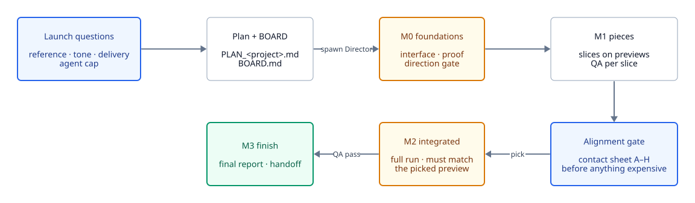
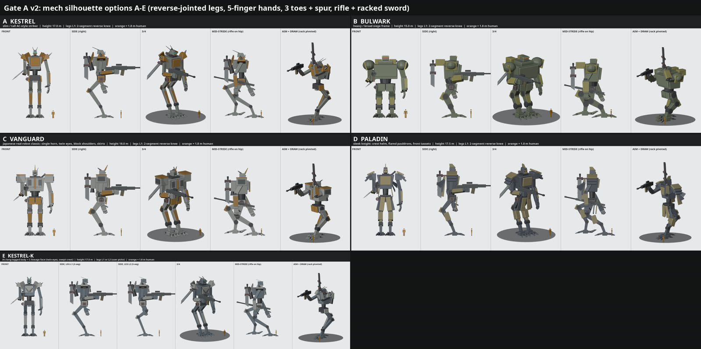
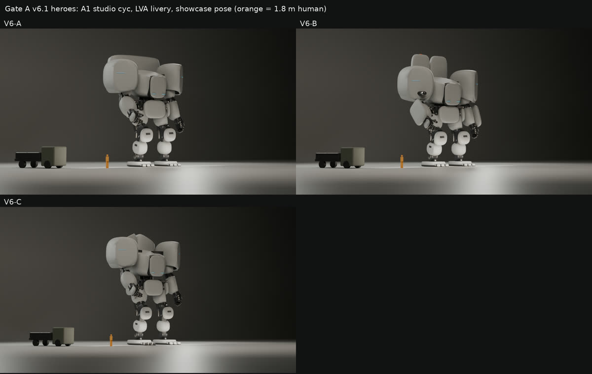

# Run lifecycle

A run from your first message to the final report. Cheap previews come before every expensive step, and nothing passes a gate without QA.

<picture>
  <source media="(prefers-color-scheme: dark)" srcset="../diagrams/run-lifecycle-dark.svg">
  
</picture>

## Launch

The main session, from [`SKILL.md`](../../skills/directing-agent-teams/SKILL.md):

1. **Check past projects.** The skill's case studies, yours in `~/.claude/directing-agent-teams/implementations/`, and the project's own. A similar case's "Best execution" shapes the questions and the plan.
2. **Write `PLAN_<project>.md`:** the goal, the deliverables, what's fixed. Team design is left to the Director.
3. **Ask one round of at most about five questions,** for what only you can supply: the reference, the tone and era in your words, identity versus features, delivery specs, and the cap. Everything else gets a proposed default in the plan.
   - **Designed or visual work needs a reference.** Without one, the design gate turns into rounds of guessing at an hour each.
   - **Identity versus features.** What defines the thing (silhouette, role, scale) is decided first. Features (accessories, mechanisms) wait until the core is picked, so they don't constrain the shape work.
4. **Warn about permission prompts.**
5. **Create `BOARD.md`**, spawn the Director in the background, and write its ID into the Roster.

## Milestones

| Milestone | What happens | Passes when |
| --- | --- | --- |
| M0 foundations | One interface owner builds the shared API, schema and data before anyone fans out. An M0 proof shows the invariant that matters. The direction alignment gate runs in parallel | QA signs off the proof; you (or the Director's rule) pick a direction |
| M1 pieces | Each piece is built and checked on its own preview, as slices | QA signs off each piece |
| Alignment gate | A cheap array of options before any expensive run | You pick, or the Director decides by a declared rule |
| M2 integrated | The full-scale run, which must match the picked preview | QA signs off; drift from the preview is a FAIL |
| M3 finish | Final QA, README, the final report | QA signs off; the report goes to the main session |

**The M0 proof** depends on the project. For a refactor, output with every effect off matches the old pipeline, byte for byte where it's deterministic. For a new project, fixed inputs pass through untouched (hashes) and builds are deterministic from a seed.

**Previews versus full scale.** The plan defines both: length, resolution, samples, minutes. Agents iterate on previews. Full-scale runs happen only at gates, with the Director's approval, and a fixed number per item per gate attempt. Fixes after an M2 failure loop on previews, not on repeated full runs.

## Alignment gates

Before any long-lead item (a full render, a training run, a long composition, a research sweep), the Director builds 4 to 8 cheap variants on one contact sheet at `align/<item>/index.md`, labelled A to H, each with a one-line description and its full-scale cost.

- **Vary what's expensive to reverse:** the camera path, style, instrumentation, scope. Not trivia.
- **Render at the fidelity the question needs.** Flat blockouts decide a silhouette. Style, era or finish needs materials and lighting, or you'll reject the render style when the problem was the render.
- **Every option descends from your reference** in `align/reference/`.
- **The Director runs its own taste pass first,** and lists the flaws it sees in the index.
- **After two rejected sheets, stop guessing.** Ask you for a reference or a list of what's wrong.
- **If previews don't predict full scale** (simulations, training, anything nonlinear in size), the array is a short pilot at production settings.
- **The pick becomes a check.** QA turns it into something measurable (an outline overlap, key dimensions, a golden output) and scores later builds against it, so drift fails on its own.

### From the mech run

The mech run launched without a reference, and its design gate went six rounds. The first sheet was flat Workbench blockouts of five options:

The user rejected it, sent a reference, and two rounds later pivoted: *"the options so far look out of the 50's or 90's. I'm thinking practical 2133"*. That's the fidelity lesson: flat renders got judged as the design. Round 6 was rendered properly, from a second reference:

The answer, on a revision of it: *"too far in the apple/silicon valley side of things... think critically about every component and how it should work at that scale"*. That started the plausibility pass, and the cast-armour design in the [README](../../README.md) came out of it. Each reference the user sent moved the design further than any sheet had, which is why the skill now asks for one before launch.

## Offline decisions

When you're unreachable, the Director decides and records each call as a D-number with its reason:

- A choice that **blocks** other work gets a provisional pick by a rule declared in advance, labelled PROVISIONAL, with a comparison of the alternatives and a cheap swap (a one-command remux, a config flag).
- A choice that blocks nothing gets a comparison table, marked PENDING USER DECISION.
- If you give a brief instead of picking, the brief becomes tests on every relevant card, and the Director shows results rather than options.

## Scope changes

- **A new ask becomes a queued slice** with a priority, not a re-plan of every lead. The Director re-plans only when the ask changes the identity or the milestone.
- **Park, don't delete.** A cut workstream hands off and is marked parked, so a reversal costs a respawn, not a rebuild.
- **Freeze with one final round.** When you say "stop after this round", the Director runs one time-boxed fix-or-classify round with a deadline. Whatever is still open becomes a listed known issue.
- **After 3 failed QA rounds** on one item, the Director cuts it or accepts it with a known issue, and records which.

## Wind-down

The Director parks every lead, kills its own timers, releases locks and writes `handoff/director.md`; then the main session checks that nothing is still running and writes `handoff/main.md`. Steps in [Running a team](../running-a-team.md#stopping-for-the-day).

## The final report

The Director's final report goes to the main session, which relays it as it is. Its contents are listed in [Running a team](../running-a-team.md#reading-the-final-report).
