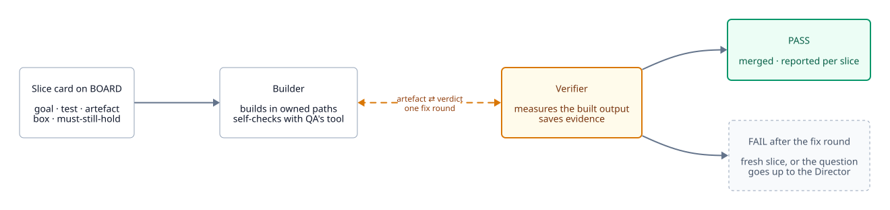
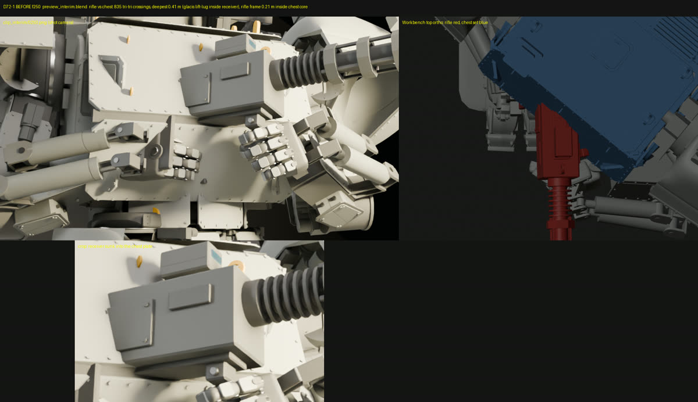
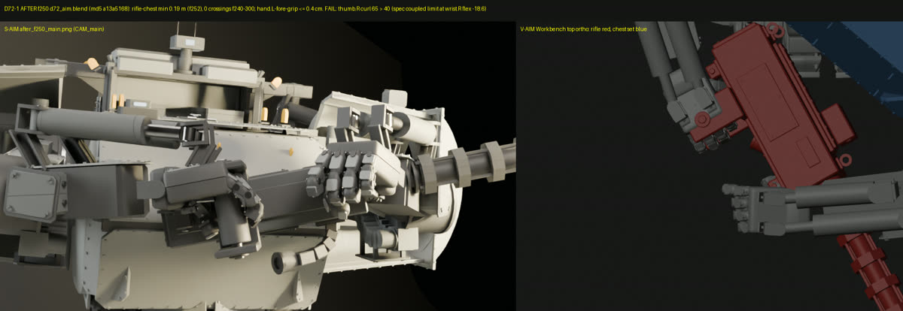

# Slices and QA

Inside each milestone, work runs as small time-boxed slices, each checked by an independent verifier against a written card.

<picture>
  <source media="(prefers-color-scheme: dark)" srcset="../diagrams/slice-loop-dark.svg">
  
</picture>

## Why slices

Big rounds (a whole-body rebuild, a whole-spec revision) take hours, bury your feedback, and fail QA with hundreds of findings at once. In the mech run, each whole-machine revision took one to three hours and came back with 245 rest-pose overlaps. Switching to 20–30 minute slices, each with a paired verifier, meant a result every few minutes.

## What a slice is

- **One** component or question
- **one** numeric acceptance test
- **one** reviewable artefact: a still, a clip of 5 seconds or less, or a table
- **one** owner
- a time box of about 20–60 minutes (25–30 for IK, pose or geometry work)

It's written as a slice card on BOARD before work starts (see [Project files](../project-files.md#slice-cards)). The card also lists the neighbouring requirements that must still hold. A fix that passes its own test while putting every joint on its stops is still a failure.

## The builder–verifier loop

1. The **builder** builds only what the card asks, only in the paths it lends. It backs up any file before editing, and puts new work in new files.
2. It self-checks with the **verifier's own tool** from `qa/tools/`, so the numbers agree, and reports "self-check, unverified".
3. The **verifier** measures the built output, not the spec or the builder's log, and saves evidence to `qa/slices/<slice-id>/`. It sends the verdict to the builder as well as the Director.
4. The builder gets **one fix round** inside its box. The verifier re-measures once.
5. **PASS** merges the slice. **FAIL** after the fix round becomes a fresh slice. If one item fails twice, the Director stops re-slicing and sends the design question up.

Every measured problem gets an owner the same hour: a fix slice or a known-issue decision.

## A real slice: D72-1

From the mech run, after the user said "the gun is in his chest". The card, lightly trimmed:

```markdown
- SLICE D72-1 [fail] owner=S-AIM box=20 started=17:00
  goal: rifle receiver clear of the chest armour at the two-handed aim (f240-300),
        by re-solving the aim with a clearance term
  test: min rifle-to-chest distance >= 0.10 m on every frame 240-300 (0 interpenetration),
        measured by V-AIM's tool on the built blend; joint limits respected;
        hands on grip/fore-grip <= 2 cm
  artefact: before_after_f250.png (shot camera + a side diagnostic)
```

Before: the receiver sunk 0.40 m into the chest, 835 triangle crossings.



After the builder's re-solve:



The verifier's verdict, condensed:

| Test | Before | After | Verdict |
| --- | --- | --- | --- |
| Rifle-to-chest ≥ 0.10 m | 0.40 m inside | 0.19 m clear, 0 crossings | PASS |
| Fore-grip hand ≤ 2 cm | 7.6–8.8 cm | 0.3–0.4 cm | PASS |
| Joint limits | 2 violations | right thumb past its coupled limit (new), left thumb still over | **FAIL** |

The image looks fixed, and two of three tests pass, but the slice failed. The verifier also noted, outside the card, that the barrel now pointed 28° off the line of fire with several joints on their stops. The builder hit its 20-minute box without fixing the thumbs, so the FAIL stood and the work went to a fresh slice, D72-2. The Director's Lessons now say to put the neighbouring requirements on the card, and to give IK slices 25–30 minutes instead of 20.

## Rules that keep slices honest

- **At most 2 slices in flight per lead.** No new spec revision starts while slices against the previous one are still open.
- **Freeze interfaces, iterate content.** The spec schema, rig contract and naming are fixed early; slices change values within them.
- **Parallel edits to one shared artefact** (a timeline, a scene) happen in per-slice copies. One integration slice merges them, and its verifier checks that the merge reproduces each slice's passed numbers.
- **Integrate on a cadence,** for example every 2–3 hours: merge the passed slices, run the full QA suite, send you one still set.
- **Label every still** with its build, scene state and lighting state.
- **Move recurring checks into the generators.** When QA keeps catching the same failure class, it becomes a shared, tested library the builders use as a hard constraint.

## Independent QA

From [`qa.md`](../../skills/directing-agent-teams/qa.md):

- **QA finds failures, it doesn't confirm success,** and it never edits product code.
- **Fresh reviewers for each gate,** producing their own evidence.
- **Every finding has evidence:** a path or frame, plus a saved crop, log excerpt or measurement in `qa/`. Every FAIL has a concrete repro.
- **Measure the built output.** A result from the spec alone is reported as "spec-only".
- **Regressions:** unchanged areas still match the old output or the M0 proof.
- **Validate measuring tools first.** A new or changed tool must catch a known deep failure before its PASSes count. When a tool is found flawed, every verdict that used it is re-run.
- **Visible beats accepted.** Before a defect is accepted as a known issue, QA checks whether the shot cameras can see it. If a viewer can see it, it's fix-if-visible.
- **Unverified is listed, never passed.** Anything no agent can check (how audio sounds, how it looks on a real device) goes in the report as unverified.

## Checks for things that move

From the mech run's motion work:

- **Test motion against scale physics,** not only the card: acceleration caps (about 1 g or less for a building-sized machine), step timing for the scale (Froude scaling), balance, and an inverse-dynamics checker where one exists. Card numbers can pass while the motion is physically absurd.
- **"Never reverses" tests cover every axis** (height, reach, angle), not one number. A swing angle that never reversed hid a 4.8 m height pump.
- **Readability over exaggeration.** When correct motion reads too small, fix it with framing and secondary cues (shake, dust, reactions), not by breaking the physics.
- **Tool defaults nobody agreed are "unadjudicated".** A verifier reports a threshold the Director never set (an acceleration limit, a foot-slide tolerance) as unadjudicated, not as PASS or FAIL.

## Taste

A separate taste reviewer acts as a skeptical audience. It opens every image itself, says what reads wrong and where in the frame, ranks the three best and three worst, and says what one change would fix each worst one. It always says what got worse since the last version. It recommends; the Director or you decide.
